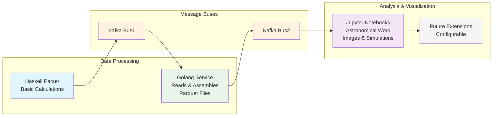

# black hole (BHAEB)


## Project Goal

This project aims to build a simple **finite-state machine (FSM)** to model the lifecycle of black holes. While the current implementation is basic and conceptual, the long-term vision is to evolve this into a more ambitious and formal language capable of interpreting astrophysical phenomena through the lens of computer science.

## Structure project
```
├── datasets-test # Data science experiments
├── docs # images and notes
├── flake.nix
├── README.md
├── research # haskell FSM
└── stream-producer # golang data science and streaming
```

## Resource
### DataSets
- [Filter Data](https://eventhorizontelescope.org/for-astronomers/data)


## Schema

