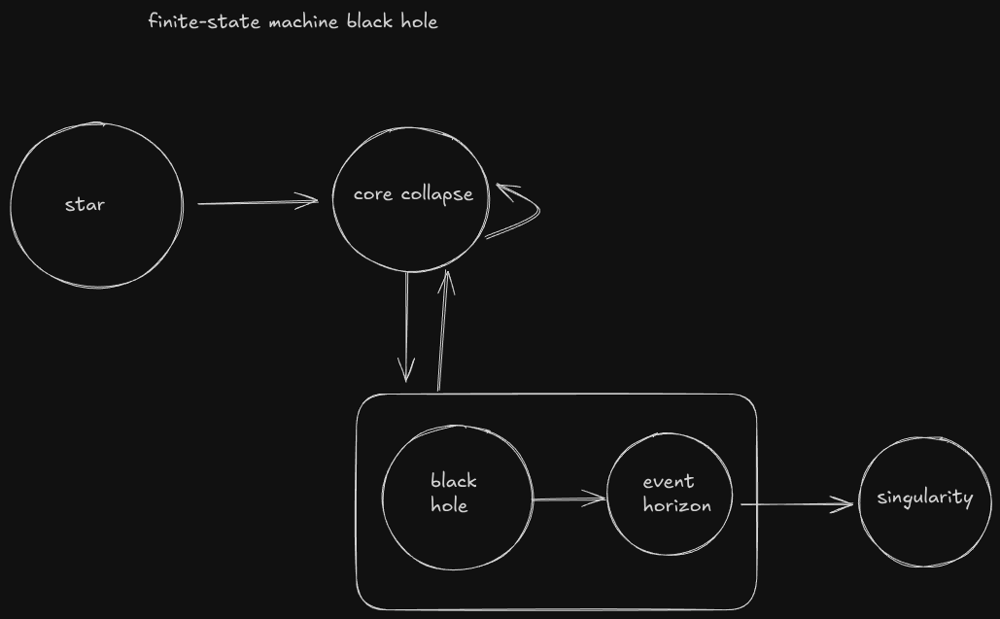

# Machine state black hole (BHAEB)


## Project Goal

This project aims to build a simple **finite-state machine (FSM)** to model the lifecycle of black holes. While the current implementation is basic and conceptual, the long-term vision is to evolve this into a more ambitious and formal language capable of interpreting astrophysical phenomena through the lens of computer science.

---

## Current Progress — Phase 1



### Clear Definition of Primary States

The FSM currently models the typical evolution of a massive star as:

```haskell
black hole → event horizon → singularity
```

This sequence represents the classical astrophysical process leading to black hole formation.

---

### Feedback Loop in `core collapse`

A self-loop is defined in the `core collapse` state to represent the possibility of multiple attempts or conditions before the system transitions to a black hole. Not all collapses lead directly to a black hole; other outcomes are possible.

---

### Encapsulation of the Black Hole State

The internal structure of a black hole is modeled as a **compound state** or sub-FSM:

```haskell
black hole → event horizon → singularity
```


This encapsulation reflects the idea of "internal phases" of a black hole post-formation.

---

### Irreversible Transitions

All transitions from the `event horizon` onward are modeled as **unidirectional**, indicating that once matter crosses the event horizon, it cannot return — capturing the physical irreversibility of this boundary.

---

## Future Features

### Additional Post-Collapse Outcomes

Not all stars become black holes. Future FSM versions will include conditional branches from `core collapse` to account for:

- `white dwarf`
- `neutron star`
- `supernova` (without black hole formation)

These additions will make the FSM more accurate and comprehensive.

---

### Transition Conditions

FSMs typically involve **event-driven transitions**. In future versions, transitions will depend on physical parameters such as mass. For example:

- `mass > 3 solar masses` ⇒ transition to `black hole`
- `1.4 < mass ≤ 3 solar masses` ⇒ transition to `neutron star`

This will significantly enhance the model's richness and realism.

---

### Semantics of Internal States

A deeper exploration will determine whether `event horizon` and `singularity` are **substates** of the black hole or **intrinsic properties**. If treated as substates, further refinement will clarify their internal transitions and semantic structure.

---

##  Disclaimer

This FSM is a **conceptual abstraction**, not a strict astrophysical simulator. It serves as a creative intersection between **astrophysics** and **computational formalism**, and may evolve into a formal modeling or simulation tool in the future.


